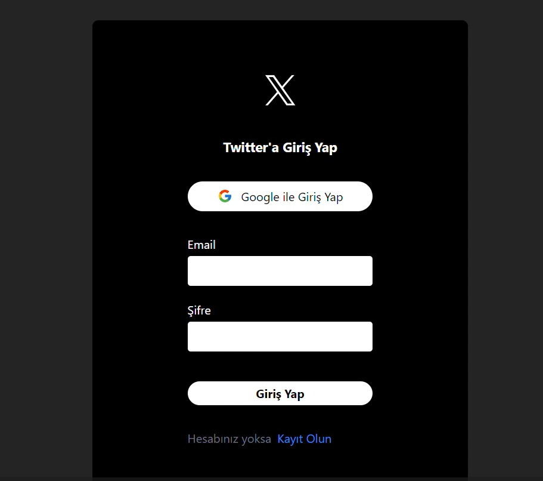

# Firebase_X_Clone

This project is a simple Twitter clone built with React and Firebase. Users can create, view, edit, like, and delete tweets with real-time data synchronization. It includes features like user authentication, database management, and image storage through Firebase, allowing login via Google or email. Responsive pages were created with Tailwind CSS, and Toastify provides feedback messages after user actions.

# Tools and Libraries Used

- react-router-dom
- react-toastify
- react-icons
- moment
- uuid
- firebase
- tailwind

# Screenshots

# Vercel

https://twitter-clone-firebase-alpha.vercel.app/

## Gif
